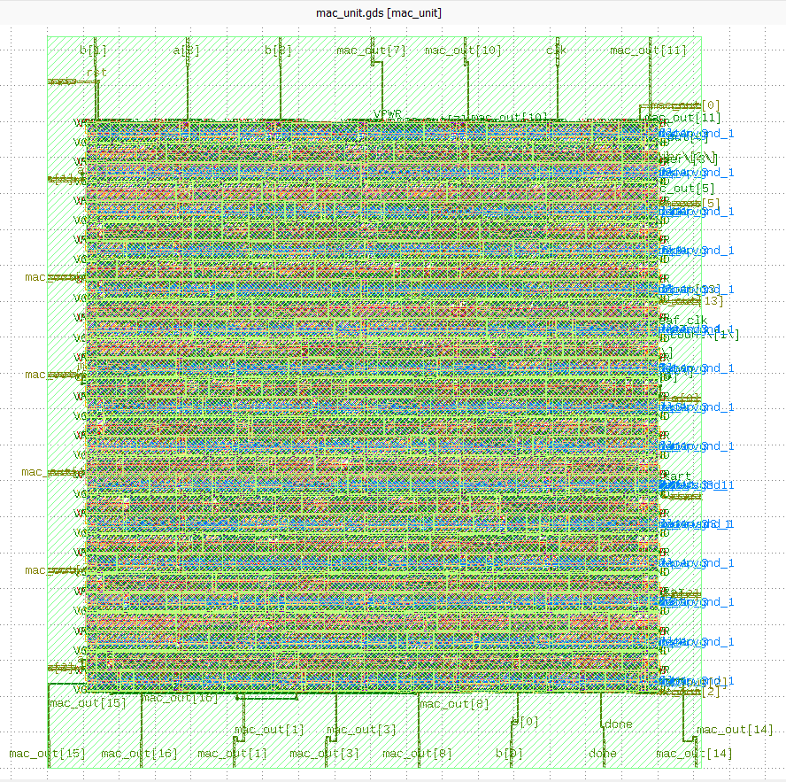

<h1 align="center">MAC UNIT RTL → GDSII ASIC Implementation</h1>

<p align="center">
<b>
RTL Design & Functional Verification using Cadence
<br>
Complete RTL-to-GDSII ASIC Implementation using Verilog HDL, OpenLane & Sky130 PDK
</b>
</p>

<p align="center">


</p>

---

# Overview

A **Multiplier-Accumulator (MAC)** unit is a specialized hardware component in digital processors that calculates the product of two numbers and adds that result to an accumulator. It is the fundamental building block for speeding up intensive computations in Digital Signal Processing (DSP, embedded systems, machine learning accelerators, and modern processor architectures.

This repository demonstrates the complete **RTL-to-GDSII ASIC implementation** of a custom **4-bit Multiply–Accumulate (MAC) Unit**.

The project was completed in **two development phases**.

### Phase 1 – RTL Design & Functional Verification

The RTL modules were designed using **Verilog HDL** and initially verified in the **Cadence VLSI Design Suite**, where individual modules were developed, integrated, and functionally validated.

### Phase 2 – RTL-to-GDSII ASIC Implementation

Due to restricted access to the university Cadence environment outside the campus network, the verified RTL was migrated to an **Azure Virtual Machine**. The complete ASIC implementation was then carried out using the **OpenLane** open-source RTL-to-GDSII flow together with the **Sky130 Process Design Kit (PDK)**.


# MAC Unit Architecture

<p align="center">

</p>

<p align="center">
<b>Figure 1.</b> Block Diagram of the 4-bit MAC Unit

---

# RTL Design using Cadence

The RTL modules were initially developed and verified using the **Cadence VLSI Design Suite**. Each module was individually designed and verified before integrating them into the complete MAC Unit.

The RTL schematics generated using Cadence are shown below.

---

## 4-bit Multiplier

The **4-bit Shift-and-Add Multiplier** consists of the following hardware components:

- **16 AND Gates** for partial product generation (4 × 4 partial products).
- **Half Adders (HA)** to add partial products where no carry input is required.
- **Full Adders (FA)** to add partial products along with carry propagation.
- **Shift-and-Add Logic** to accumulate the generated partial products.
- **8-bit Output Register** to store the final multiplication result.

The multiplication operation is expressed as:

```text
P = A × B
```

where:

- **A[3:0]** → First 4-bit input
- **B[3:0]** → Second 4-bit input
- **P[7:0]** → 8-bit multiplication result

<p align="center">

</p>

<p align="center">
<b>Figure 2.</b> RTL Schematic of the 4-bit Multiplier generated using Cadence
</p>

---

## 17-bit Carry Lookahead Adder

The **17-bit Carry Lookahead Adder (CLA)** is designed to perform high-speed binary addition by generating carry signals in advance, reducing the delay associated with ripple carry propagation.

The design consists of:

- **17 Sum Bits** for generating the final addition result.
- **Carry Generate (G) Logic** to determine carry generation.
- **Carry Propagate (P) Logic** to determine carry propagation.
- **Carry Lookahead Network** for parallel carry computation.
- **Carry Output** to indicate overflow into the next stage.

```text
S = A + B
```

where:

- **A[16:0]** → First 17-bit input
- **B[16:0]** → Second 17-bit input
- **S[16:0]** → 17-bit Sum
- **Cout** → Carry Output

<p align="center">

</p>

<p align="center">
<b>Figure 3.</b> RTL Schematic of the 17-bit Carry Lookahead Adder generated using Cadence
</p>

---

## MAC Unit

The **4-bit Multiply–Accumulate (MAC) Unit** integrates three major arithmetic modules to perform multiplication followed by accumulation in a single operation.

The design consists of:

- **4-bit Shift-and-Add Multiplier** for generating the product of two 4-bit operands.
- **17-bit Carry Lookahead Adder (CLA)** for high-speed addition of the multiplication result and the accumulated value.
- **17-bit Accumulator** for storing the intermediate and final accumulated results.
- **Clock and Reset Logic** for synchronous operation.
- **Enable Control Logic** to control the accumulation process.

```text
MAC = (A × B) + Accumulator
```

where:

- **A[3:0]** → First 4-bit input operand
- **B[3:0]** → Second 4-bit input operand
- **A × B** → 8-bit multiplication result
- **Accumulator[16:0]** → Previously accumulated value
- **MAC Output[16:0]** → Updated accumulated result

<p align="center">

</p>

<p align="center">
<b>Figure 4.</b> RTL Schematic of the Complete MAC Unit generated using Cadence
</p>

---

# Azure Virtual Machine Setup

The complete **RTL-to-GDSII ASIC implementation** was carried out on an **Azure Virtual Machine (Ubuntu Linux)** with **OpenLane** and the **Sky130 Process Design Kit (PDK)** installed.

Connect to the Azure VM using SSH.

```bash
ssh -i "<path-to-your-key>.pem" abhishek@<vm-public-ip>
```

Replace the placeholder values with your own:

- `<path-to-your-key>.pem`
- `<vm-public-ip>`

Once connected, all remaining commands in this repository are executed inside the Azure Virtual Machine.

---

# Project Setup

Navigate to the **OpenLane** directory and follow the steps below.

<table>

<tr>
<th width="15%">Step</th>
<th>Description</th>
</tr>

<tr>
<td><b>Step 1</b></td>
<td>

Navigate to the **OpenLane** designs directory and create a new project.

```bash
cd ~/OpenLane
cd designs
mkdir MAC_UNIT
cd MAC_UNIT
```

</td>
</tr>

<tr>
<td><b>Step 2</b></td>
<td>

Create the required project directories.

```bash
mkdir src
mkdir testbench
```

</td>
</tr>

<tr>
<td><b>Step 3</b></td>
<td>

Move into the **src** directory and create the RTL modules.

```bash
cd src

nano multiplier.v
nano adder.v
nano accumulator.v
nano mac.v
```

Copy the corresponding Verilog code into each file, save it, and exit the editor.

</td>
</tr>

<tr>
<td><b>Step 4</b></td>
<td>

Return to the project directory and create the testbench.

```bash
cd ..
cd testbench

nano mac_tb.v
```

Copy the testbench code into the file, save it, and exit the editor.

</td>
</tr>

<tr>
<td><b>Step 5</b></td>
<td>

Return to the project directory and create the OpenLane configuration file.

```bash
cd ..

nano config.json
```

Copy the OpenLane configuration into the file, save it, and exit the editor.

</td>
</tr>

<tr>
<td><b>Step 6</b></td>
<td>

Verify that all project files have been created successfully.

```bash
tree -I "runs|mac_sim"
```

</td>
</tr>

</table>

<td>

</td>

<p align="center">
<b>Figure 5.</b> Terminal View
</p>

---

# RTL Compilation

Navigate to the project directory.

```bash
cd ~/OpenLane/designs/MAC_UNIT
```

Compile all RTL source files together with the testbench.

```bash
iverilog -o mac_sim \src/accumulator.v \src/adder.v \src/multiplier.v \src/mac.v \testbench/mac_tb.v
```

If the compilation is successful, no errors will be displayed.

---

# Functional Simulation

Execute the compiled simulation.

```bash
vvp mac_sim
```

The terminal displays the multiplication and accumulation results generated by the testbench.

<p align="center">

</p>

<p align="center">
<b>Figure 6.</b> Functional Simulation Output
</p>

---


# GTKWave Verification

The testbench generates a **dump.vcd** file that stores all signal transitions during simulation.

Open the waveform using GTKWave.

```bash
gtkwave dump.vcd
```

Within GTKWave,

- Select the top-level module **tb_mac_unit**
- Add the required signals
- Zoom appropriately
- Verify all outputs

Signals verified include:

- Clock
- Reset
- Enable
- Input A
- Input B
- Multiplier Output
- Accumulator Output
- MAC Output

---

# RTL → GDSII ASIC Implementation

After successful RTL verification, the complete ASIC implementation was performed using the **OpenLane** open-source RTL-to-GDSII flow together with the **Sky130 Process Design Kit (PDK)**.

# Launching OpenLane

Navigate to the OpenLane directory.

```bash
cd ~/OpenLane
```

Launch the Docker container.

```bash
make mount
```

Run the complete RTL-to-GDSII flow.

```bash
./flow.tcl -design MAC_UNIT
```

OpenLane automatically executes every stage of the ASIC implementation.

---

# OpenLane Execution

<table>

<tr>

<td>

</td>

<td>

</td>

</tr>


<tr>

<td>

</td>

<td colspan="2" align="center">

</td>

</tr>

</table>

# Successful Flow Completion

The OpenLane terminal displays

```text
[SUCCESS]: Flow complete.
```

This indicates successful completion of

- RTL Elaboration
- Logic Synthesis
- Floorplanning
- IO Placement
- Clock Tree Synthesis
- Routing
- Static Timing Analysis
- DRC
- LVS
- GDSII Generation

---

# KLayout Visualization

Locate the generated GDSII file.

```bash
find . -name "*.gds"
```

## Final Physical Layout

The completed layout consists of

- Standard Cells
- Metal Layers
- Vias
- Power Rails
- Signal Routing

generated automatically by the OpenLane physical design flow.

<p align="center">

</p>

<p align="center">
<b>Figure 16.</b> Final MAC Unit Layout in KLayout
</p>

---

# 3D GDS Visualization

To further visualize the generated ASIC layout, the final **GDSII** file was uploaded to the **Tiny Tapeout GDS Viewer**, which provides an interactive three-dimensional representation of the fabricated layout.

Tiny Tapeout GDS Viewer

https://gds-viewer.tinytapeout.com/

## Top View

<p align="center">

</p>

<p align="center">
<b>Figure 17.</b> Top View of the Final GDSII Layout
</p>

## Isometric View

<p align="center">

</p>

<p align="center">
<b>Figure 18.</b> Isometric View of the Final GDSII Layout
</p>

---

# Source Files

| File | Description |
|------|-------------|
| `multiplier.v` | 4-bit Shift-and-Add Multiplier |
| `adder.v` | 17-bit Carry Lookahead Adder |
| `accumulator.v` | 17-bit Accumulator |
| `mac.v` | Top-Level MAC Unit |
| `mac_tb.v` | Functional Testbench |
| `config.json` | OpenLane Configuration |

---

# Conclusion

The complete **RTL → GDSII ASIC implementation** of the **4-bit Multiply–Accumulate (MAC) Unit** has been successfully demonstrated.

The project involved:

-  RTL Design using Verilog HDL
-  RTL Verification using Cadence
-  RTL-to-GDSII Implementation using OpenLane
-  Final GDSII Layout Generation using Sky130 PDK

This project provided hands-on experience with both **Cadence** and **OpenLane**, covering the complete digital ASIC design flow from RTL development to fabrication-ready layout generation.

---

## ⭐ If you found this project useful, consider giving this repository a Star!
---
